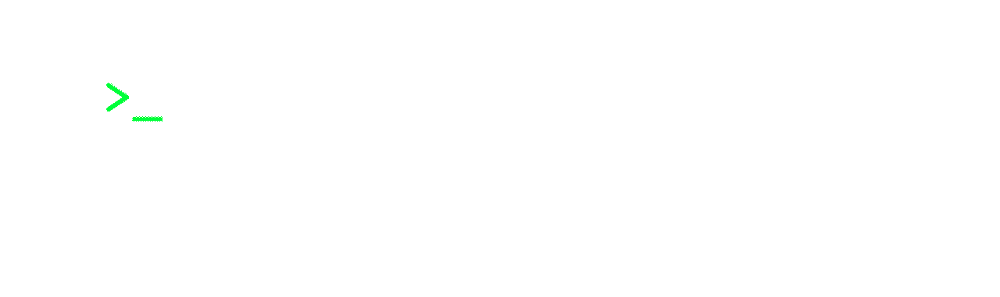

#  About Me 	🐾
Hi there! My name is Cibele Duarte. I'm currently specializing in Data Science, with a strong passion for Python, Machine Learning, NLP, and SQL. With a background in video editing and animation, I bring a unique perspective to my journey into the world of data science and development.

As I invest in connecting my skills in the dev world, I'm excited to explore new opportunities for innovation and creativity at the intersection of data science, technology, and design.

# What You'll Find Here 🔍

### 🔥 Some of my projects 🔥
- *[Bitcoin Calculator](https://github.com/cibele-r-d/Bitcon_Calculator)*
- *[News Analysis](https://github.com/cibele-r-d/News-Analysis)*
- *[Semantic Analisys](https://github.com/cibele-r-d/semantic)*

### Learning Journey ✏️ 
As an advocate for lifelong learning, I'm constantly honing my skills in HyperionDev - Data Science. Follow along as I share my learning journey through code and projects.

# Connect With Me 🔗
Let's connect! Whether you're interested in collaborating on a project, discussing ML or NLP, or to just say hi, feel free to reach out to me.

**Website:** www.cibeleduarte.com

**Email:** cibeleduarte@gmail.com

**LinkedIn:** [linkedin.com/in/cibele-duarte](https://www.linkedin.com/in/cibele-duarte)

Thank you for visiting my GitHub profile. I hope you find something interesting and valuable here. Don't hesitate to get in touch—I'd love to hear from you! :shipit: 

<!--
**cibele-r-d/cibele-r-d** is a ✨ _special_ ✨ repository because its `README.md` (this file) appears on your GitHub profile.

Here are some ideas to get you started:

- 🔭 I’m currently working on ...
- 🌱 I’m currently learning ...
- 👯 I’m looking to collaborate on ...
- 🤔 I’m looking for help with ...
- 💬 Ask me about ...
- 📫 How to reach me: ...
- 😄 Pronouns: ...
- ⚡ Fun fact: ...
-->
